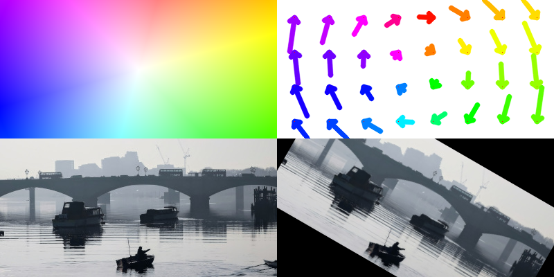
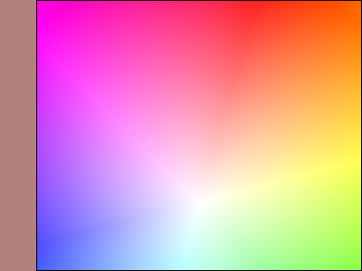
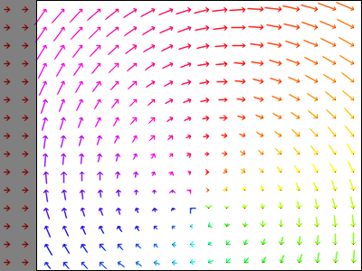

Introduction
============

**Oflibnumpy:** a handy python **o**\ ptical **f**\ low **lib**\ rary, based on **NumPy** arrays, that enables the
manipulation and combination of flow fields while keeping track of valid areas (see "Usage"). It is mostly code
written from scratch, but also contains useful wrappers for specific functions from libraries such as OpenCV's
``remap``, to integrate them with the custom flow field class introduced by oflibnumpy. If you use this code, please
acknowledge us with the following citation:

.. code-block::

    @article{ravasio_oflib,
      title={oflibnumpy & oflibpytorch: Optical Flow Handling and Manipulation in Python},
      author={Ravasio, Claudio S and Da Cruz, Lyndon and Bergeles, Christos},
      journal={Journal of Open Research Software (JORS)},
      year={2021},
      note={In press}
    }

Note there is an equivalent flow library called Oflibpytorch, mostly based on PyTorch tensors. Its
`code is available on Github`_, and the `documentation is accessible on ReadTheDocs`_.

.. _code is available on Github:  https://github.com/RViMLab/oflibpytorch
.. _documentation is accessible on ReadTheDocs: https://oflibpytorch.rtfd.io

**Features:**

- Provides a custom flow field :class:`~oflibnumpy.Flow` class for both forwards and backwards ('source' / 'target' based) flow fields
- Provides class methods to create flow fields from lists of affine transforms, or a transformation matrix
- Provides class methods to resize the flow field, visualise it, warp images, find necessary image padding
- Provides a class method to process three different types of flow field combination operations
- Keeps track of valid flow field areas through said operations
- Provides alternative functions to avoid the explicit use of the custom flow class, with slightly limited functionality

**Installation:**

.. code-block::

    pip install oflibnumpy

**Testing:**

In the command line, navigate to the folder ``oflibnumpy/tests`` and run:

.. code-block::

    python -m unittest discover .

**Code example:**

.. code-block:: python

    import oflibnumpy as of
    # Make a flow field and display it
    shape = (300, 400)
    flow = of.Flow.from_transforms([['rotation', 200, 150, -30]], shape)
    flow.show()

.. code-block:: python

    # Combine sequentially with another flow field, display the result
    flow_2 = of.Flow.from_transforms([['translation', 40, 0]], shape)
    result = flow.combine_with(flow_2, mode=3)
    result.show(show_mask=True, show_mask_borders=True)

.. code-block:: python

    result.show_arrows(show_mask=True, show_mask_borders=True)

Contents
========

.. toctree::
    :maxdepth: 2

    self
    usage
    documentation
    licensing
    changelog
